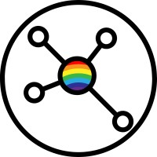
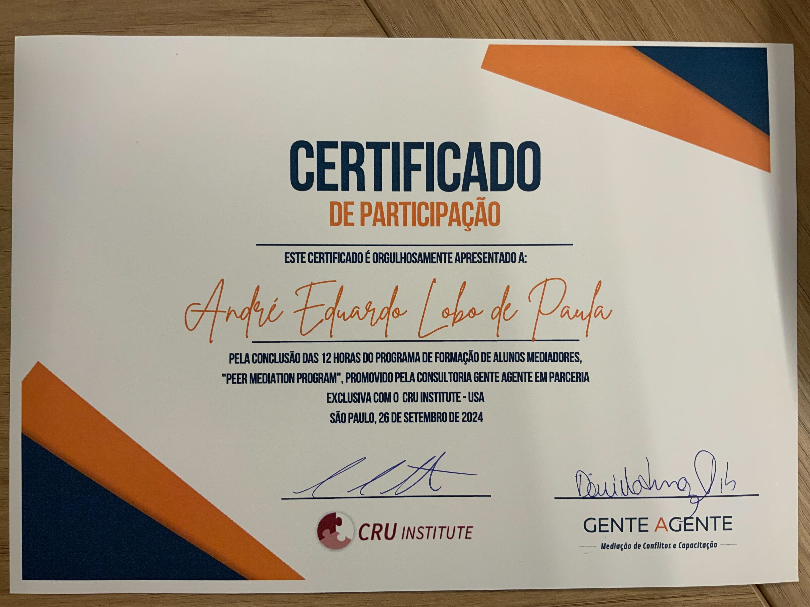

  Language:
  &nbsp;
  [ <a title="Português Brasileiro" href="./README.md"><kbd></kbd></a> ]
  &nbsp;
  <a title="English" href="./README.it.md"><kbd></kbd></a> 
  &nbsp;

<h1 align="center">
  
</h1>

<table align="center">
  <tr>
    <td align="center" style="padding-right: 10px;">
      
    </td>
    <td align="center" style="padding-right: 10px;">
      
    </td>
    <td align="center" style="padding-right: 10px;">
      
    </td>
    <td align="center" style="padding-right: 10px;">
      
    </td>
  </tr>
</table>

# 👋 Hello, World! Sou o André Lobo 

  

Olá! Eu sou André Lobo, estudante de Engenharia de Software no Inteli – Instituto de Tecnologia e Liderança, onde fui aprovado com bolsa integral e auxílios. Paralelamente, também estudo Tecnologia da Informação na Univesp (Universidade Virtual do Estado de São Paulo), onde fui aprovado em quinto lugar no processo seletivo. Cursar duas graduações simultaneamente reflete minha sede por conhecimento e minha crença de que nunca devemos parar de aprender.

Sou voluntário há mais de dois anos no Family Search, uma organização que me permitiu transformar meu hobby de genealogia em uma experiência de voluntariado. Ajudar outras pessoas a descobrirem suas origens tem sido uma jornada enriquecedora e gratificante.

Atuo como mediador de conflitos no Inteli, auxiliando voluntariamente na resolução de desacordos entre colegas, o que me permite exercitar habilidades interpessoais e de comunicação essenciais tanto no ambiente acadêmico quanto no corporativo. Na Inteli Junior, desenvolvo projetos para clientes e também contribuo na área de pessoas, onde cuido do bem-estar dos membros e participo da mediação de conflitos, reforçando minhas habilidades de liderança, colaboração e resolução de problemas. Além disso, sou assessor da diretoria de pessoas do coletivo LGBTQIA+ Turing, onde garanto um ambiente saudável e inclusivo para todos os membros.

Busco combinar minhas habilidades técnicas e interpessoais para desenvolver soluções inovadoras que causem impacto positivo, especialmente para públicos sub-representados na sociedade.

# 📫 Gostaria de me conhecer?

Gostaria de bater um papo comigo? Basta clicar no botão abaixo e escolher o horário que for mais conveniente para você. Não se esqueça de incluir uma breve descrição do assunto que deseja conversar para que possamos aproveitar ao máximo nosso encontro. Estou ansioso para nossa troca de ideias!

  

# 📈 Minhas Métricas

  
  
  

 
  
<h2>⚙️ Projetos</h2>

  

    <table>
      <tr>
        <td width="50%">
          <h3 align="center">Cidade Unilever</h3>
          
  
            
              
            

              
            

            
<strong>HTML, CSS, JavaScript, Node.js, Phaser</strong>

            

              Desenvolvido em parceria com a Unilever Brasil, este projeto foi criado com o objetivo de 
              aprimorar o processo de onboarding dos novos funcionários da área de TI.
            

          

        </td>
        <td width="50%">
          <h3 align="center">Zuyd Connections</h3>
          
  
            
              
            

              
            

            
<strong>HTML, CSS, JavaScript, Node.js, Figma, Sails.js</strong>

            

              Plataforma web desenvolvida em parceria com a Zuyd University, com o objetivo de apoiar estudantes internacionais durante uma simulação de negócios, 
              o CESIM Game.
            

          

        </td>
      </tr>
      <tr>
        <td width="50%">
          <h3 align="center">Modelo Preditivo de Receita</h3>
          
  
            
              
            

              
            

            
<strong>Python, Pandas, NumPy, Machine Learning</strong>

            

              Atualmente, estou desenvolvendo um modelo preditivo de receitas publicitárias em parceria com a Rede Gazeta do Espírito Santo. O projeto tem como objetivo aprimorar o processo de tomada de decisões dos gestores.
            

          

        </td>
        <td width="50%">
          <h3 align="center">Modelo Preditivo: Vencedor da Competição Inteli</h3>
          
  
            
              
            

              
            

            
<strong>Machine Learing, Pandas, Numpy, Python Gradient Boosting</strong>

            

              Desenvolvi um modelo preditivo para prever se uma música será popular ou não com base nos dados dela. O modelo foi desenvolvido para a competição de modelos preditivos do Inteli, onde fiquei em primeiro lugar da minha turma e terceiro no ranking geral da faculdade, o campeonato foi realizado no Kaggle.
            

          

        </td>
      </tr>
    </table>
  

 
  
<h2>🏢 Experiência Profissional</h2>

  

    <table>
      <tr>
        <td width="50%">
          <h3 align="center">BTG Pactual</h3>
          
  
            
              
            
<strong>Figma, Scrum, UX, UI</strong>

            

              Durante meu estágio de férias na área de UX Banking no BTG Pactual, desenvolvi uma proposta para aprimorar a experiência de solicitação de crédito para clientes pessoa física. 
            

          

        </td>
        <td width="50%">
          <h3 align="center">Inteli Júnior</h3>
          
  
            
              
            
<strong>Python, JS, UX, UI, Scrum, Figma, Node.JS</strong>

            

              Sou membro da Inteli Junior, a empresa júnior do Inteli, onde atuo em duas áreas principais. Na área de Projetos, contribuo para o desenvolvimento de soluções para os clientes da empresa e na área de pessoas, atuo no apoio à mediação de conflitos entre os membros.
            

          

        </td>
      </tr>
      <tr>
        <td width="50%">
          <h3 align="center">Coletivo Turing</h3>
          
  
            
            
<strong>Assessor da Diretoria de Pessoas</strong>

            
No coletivo Turing, atuo como assessor da diretoria de pessoas, onde sou responsável pela mediação de conflitos entre os membros e pela promoção do bem-estar geral. Minha função é assegurar um ambiente acolhedor e colaborativo.

          

        </td>
      </tr>
    </table>
  

 
  
<h2>🎓 Formação Acadêmica</h2>

  

    <table style="width: 100%;">
      <tr>
        <td width="50%">
          <h3 align="center">Inteli</h3>
          
  
            
            
<strong>Engenharia de Software</strong>

            
Estudo Engenharia de Software no Inteli, onde aplico os conhecimentos adquiridos em projetos reais desenvolvidos em parceria com empresas do mercado. A metodologia de ensino é focada em projetos práticos, possibilitando o aprendizado de metodologias ágeis, soft skills, ética profissional e liderança.

          

        </td>
        <td width="50%">
          <h3 align="center">UNIVESP</h3>
          
  
            
            
<strong>Tecnologia da Informação</strong>

            
Estudo Tecnologia da Informação na UNIVESP, onde tenho a oportunidade de aplicar meus conhecimentos em projetos integradores que simulam desafios reais do mercado. Esses projetos abordam diversas áreas, como desenvolvimento de software, gestão de dados e infraestrutura de TI.

          

        </td>
      </tr>
    </table>
  

 
  
<h2>🌟 Atividades Extracurriculares</h2>

  

    <table style="width: 100%;">
      <tr>
        <td width="50%">
          <h3 align="center">Aluno Mediador voluntário</h3>
          
  
            
            
<strong>Inteli</strong>

            
Sou mediador de alunos no Inteli, onde atuo auxiliando na mediação de conflitos entre colegas. Nesse papel, desenvolvo minhas soft skills, enquanto contribuo para um ambiente acadêmico mais colaborativo e harmonioso.

          

        </td>
        <td width="50%">
          <h3 align="center">Comunidade Wave</h3>
          
  
            
            
<strong>Mentor Voluntário</strong>

            
Atuo como mentor na comunidade Wave, uma iniciativa dedicada a apoiar candidatos durante o processo seletivo do Inteli. Meu papel como mentor é oferecer suporte aos mentorados, esclarecendo suas dúvidas, ajudando a lidar com desafios e proporcionando orientação ao longo de toda a jornada de preparação.

          

        </td>
      </tr>
      <tr>
        <td width="50%">
          <h3 align="center">FamilySearch</h3>
          
  
            
            
<strong>Pesquisador e Indexador Voluntário</strong>

            
Atuo como pesquisador e indexador genealógico voluntário no FamilySearch, a maior plataforma de genealogia do mundo. Meu papel é auxiliar pessoas na descoberta de suas raízes e histórias familiares, contribuindo para que elas possam se conectar com seu passado e compreender melhor sua ancestralidade.

          

        </td>
      </tr>
    </table>
  

 
  
<h2>📜 Licenças e Certificados</h2>

  

    <table>
      <tr>
        <td width="100%">
          <h3 align="center">Mediação de Conflitos</h3>
          
  
            
              
            
<strong>Técnicas:</strong> Soft Skills, Mediação de Conflitos

            

              Concluí o programa de formação de alunos mediadores promovido pela Consultoria Gente Gente em parceria com o CRU Institute - USA. Este programa me proporcionou habilidades essenciais para a mediação eficaz de conflitos.
            

          

        </td>
      </tr>
    </table>
  

 
  
<h2>🛠️ Minhas Ferramentas Favoritas</h2>

  <h3>👨‍💻 Linguagens de Programação e Marcação</h3>
  

      
      
      
      
      
  

  <h3>🧰 Frameworks e Bibliotecas</h3>
  

      
      
      
      
      
      
      
      
      
      
  

  <h3>🗄️ Bancos de Dados e Hospedagem na Nuvem</h3>
  

      
      
      
      
  

  <h3>🛠️ Metodologias, Padrões e Ferramentas de Gestão</h3>
  

      
      
      
      
      
      
      
  

  <h3>📊 Análise de Dados e Machine Learning</h3>
  

      
      
      
      
      
      
      
      
      
  

 Mostre um pouco de ❤️ deixando uma  nesse repositório  
 

  

👨‍💻 com 💜 por André 🐺

<!--                       .oMc
                        .MMMMMP
                      .MM888MM
....                .MM88888MP
MMMMMMMMb.         d8MM8tt8MM
 MM88888MMMMc :' dMME8ttt8MM
  MM88tt888EMMc:dMM8E88tt88MP
   MM8ttt888EEM8MMEEE8E888MC
   MM888t8EEEM8MMEEE8t8888Mb
    "MM88888tEM8"MME88ttt88MM
     dM88ttt8EM8"MMM888ttt8MM
     MM8ttt88MM" " "MMNICKMM"
     3M88888MM"      "MMMP"
      "MNICKM" -->
